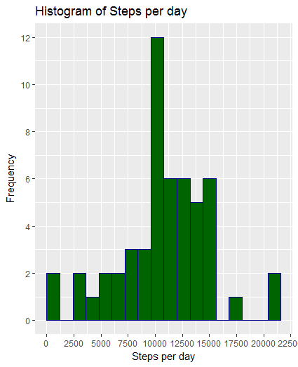
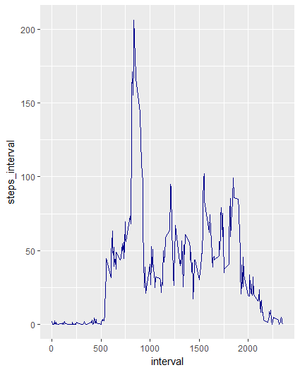
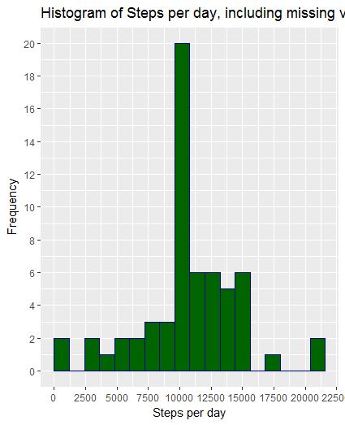
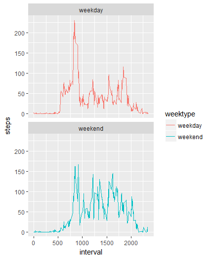

## Loading and preprocessing the data
```{r}
1)Load the data
  unzip("activity.zip")
  activity <- read.csv("activity.csv",header = TRUE, sep=',')

2)Process/transform the data (if necessary) into a format suitable for your analysis
  activity$date<-ymd(activity$date)
  str(activity)
  head(activity)
```
## What is mean total number of steps taken per day?
```{r}
1)Calculate the total number of steps per day and group by date:
  steps_day<- activity %>%
      filter(!is.na(steps)) %>%
      group_by(date) %>%
      summarize(dly_steps = sum(steps)) %>%
    
2)Using ggplot for making hystogram    
    graph1<-ggplot(steps_day,aes(x=dly_steps))+geom_histogram( boundary=0,col="darkblue",fill="darkgreen",binwidth = 1200) +
      labs(title = "Histogram of Steps per day", x = "Steps per day", y =  "Frequency")+scale_x_continuous(breaks=seq(0,25000,2500))+scale_y_continuous(breaks=seq(0,26,2))
 
3)Calculate the mean and median of the total number of steps taken per day:
  mean_steps <- mean(steps_day$dly_steps, na.rm = TRUE)
  median_steps <- median(steps_day$dly_steps, na.rm = TRUE)
``` 
 
 
## What is the average daily activity pattern?
```{r}
1)Calculate the average number of steps taken in each 5-minute interval per day and group by interval:
  interval <- activity %>%
    filter(!is.na(steps)) %>%
    group_by(interval) %>%
    summarize(steps_interval = mean(steps))
    ##using ggplot for making the time series of the 5-minute interval, and the average of steps
    ggplot(interval, aes(x=interval, y=steps_interval)) +
    geom_line(color = "darkblue")
  
 2)Which 5-minute interval, on average across all the days in the dataset, contains the maximum number of steps?
    interval[which.max(interval$steps),]
```
 

## Imputing missing values
```{r}  
1)Calculate and report the total number of missing values in the dataset (i.e. the total number of rows with NAs)

  sum(is.na(activity$steps))
  
2)Devise a strategy for filling in all of the missing values in the dataset. The strategy does not need to be sophisticated. For           example, you could use the mean/median for that day, or the mean for that 5-minute interval, etc.  
  This is done by calculting the average number of steps in the same 5-min interval

    activity_full <- activity
    nas <- is.na(activity_full$steps)
    avg_interval <- tapply(activity_full$steps, activity_full$interval, mean, na.rm=TRUE, simplify=TRUE)
    
3)Create a new dataset that is equal to the original dataset but with the missing data filled in.

    activity_full$steps[nas] <- avg_interval[as.character(activity_full$interval[nas])]
    ##verify that there are no missing values
    sum(is.na(activity_full$steps))
    
4)Make a histogram of the total number of steps taken each day and Calculate and report the mean and median total number of steps taken per day.    
    steps_full <- activity_full %>%
      filter(!is.na(steps)) %>%
      group_by(date) %>%
      summarize(steps_complete = sum(steps)) %>%
      print

    ggplot(steps_full, aes(x = steps_complete)) +
      geom_histogram(boundary=0,col="darkblue",fill="darkgreen", binwidth = 1200) +
      labs(title = "Histogram of Steps per day, including missing values", x = "Steps per day", y =      "Frequency")+scale_x_continuous(breaks=seq(0,25000,2500))+scale_y_continuous(breaks=seq(0,26,2))
      
      mean_steps_full <- mean(steps_full$steps_complete, na.rm = TRUE)
      median_steps_full <- median(steps_full$steps_complete, na.rm = TRUE)

      ##The main difference is that Watching the histogram we can take note tha the change is in the interval between 10000 and 12500         ##steps, grown from a frequency of 12 to a frequency of 20            
```
 

## Are there differences in activity patterns between weekdays and weekends?
```{r}  
1)Create a new factor variable in the dataset with two levels – “weekday” and “weekend” indicating whether a given date is a weekday or weekend day.
    activity_full <- mutate(activity_full, weektype = ifelse(weekdays(activity_full$date) == "Saturday" | weekdays(activity_full$date)       == "Sunday", "weekend", "weekday"))
    activity_full$weektype <- as.factor(activity_full$weektype)
    head(activity_full)

    interval_5min <- activity_full %>%
      group_by(interval, weektype) %>%
      summarise(steps = mean(steps))
      
2) Make a panel plot containing a time series plot
    graph2 <- ggplot(interval_5min, aes(x=interval, y=steps, color = weektype)) +
      geom_line() +
      facet_wrap(~weektype, ncol = 1, nrow=2)
    graph2
```
 
 
